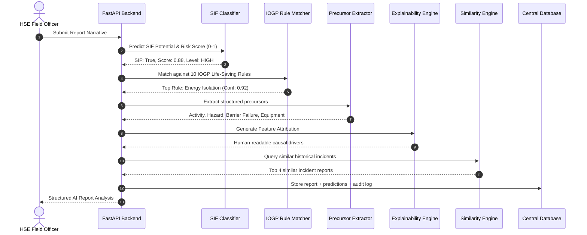
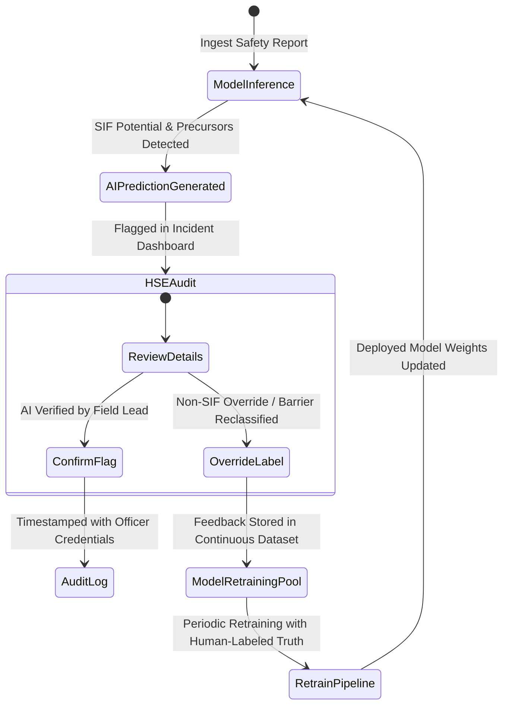
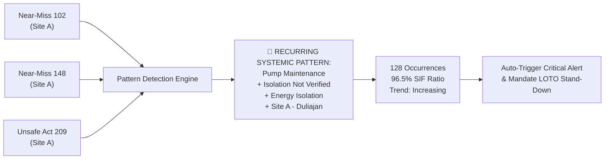

# BarrierGuard — System Architecture Documentation

**Smart India Hackathon Problem Statement 26165**  
**Organization:** Oil India Limited (OIL)  
**Project Title:** SIF Precursor Intelligence Engine  

---

## 1. High-Level System Architecture

The BarrierGuard platform connects operational field reporting (from both desktop workstations and field mobile devices) to a unified AI/NLP intelligence pipeline and a robust data store.

```mermaid
flowchart TD
    subgraph ClientLayer ["Client Layer"]
        Web["Web Enterprise Dashboard\n(React + TypeScript + Vite + Tailwind)"]
        Mobile["Field Mobile App\n(React Native + Expo)"]
    end

    subgraph APILayer ["FastAPI REST Gateway"]
        Auth["/api/auth\n(JWT Authentication)"]
        ReportsAPI["/api/reports\n(CRUD & Filters)"]
        AnalyzeAPI["/api/reports/analyze\n(Live NLP Inference)"]
        PatternsAPI["/api/patterns\n(Systemic Clustering)"]
        RulesAPI["/api/life-saving-rules\n(IOGP Rules)"]
        SitesAPI["/api/analytics/sites\n(Asset Heatmaps)"]
        AlertsAPI["/api/alerts\n(Alarms & Acknowledge)"]
        InterventionsAPI["/api/interventions\n(5-Stage Remediation)"]
    end

    subgraph MLEngine ["BarrierGuard ML & NLP Intelligence Engine"]
        Classifier["SIF Classifier\n(TF-IDF + Calibrated Logistic / SGD)"]
        RuleMatcher["IOGP Rule Matcher\n(Semantic Cosine Similarity)"]
        Extractor["Hybrid Precursor Extractor\n(Domain Heuristics + LLM Abstraction)"]
        Explainer["XAI Explainability Engine\n(Causal Feature Attribution)"]
        SimilarityEngine["Vector Similarity Engine\n(Cosine Embeddings / pgvector)"]
        PatternDetector["Pattern Clustering Detector\n(Multi-Dimensional Combinations)"]
    end

    subgraph DataLayer ["Data & Persistence Layer"]
        DB[("PostgreSQL + pgvector\n(Fallback: SQLite for Demo)")]
        KB[("IOGP Life-Saving Rules\nKnowledge Base")]
        SyntheticRepo[("OIL Operational Dataset\n(750+ Synthetic Reports)")]
    end

    ClientLayer --> APILayer
    APILayer --> MLEngine
    MLEngine --> DataLayer
    APILayer --> DataLayer
```

---

## 2. Real-Time Safety NLP Inference Pipeline

When a safety report or near-miss narrative is ingested, it flows through a sequential pipeline:

---

## 3. Human-in-the-Loop & Model Improvement Feedback Loop

BarrierGuard enforces human-in-the-loop supervision. The AI recommends classifications, while HSE Officers hold ultimate verification authority:

---

## 4. Multi-Dimensional Precursor Pattern Detection

The Primary USP of BarrierGuard is detecting recurring combinations across seemingly disconnected near-miss reports before a fatality occurs:

